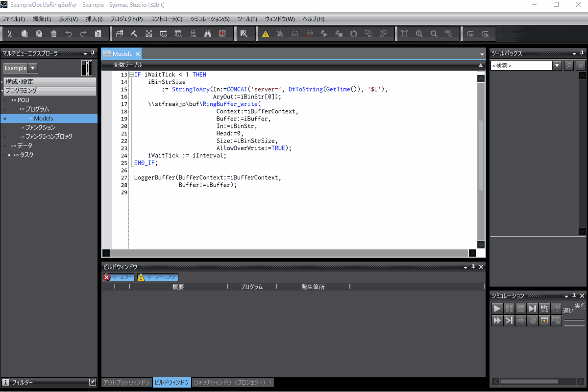
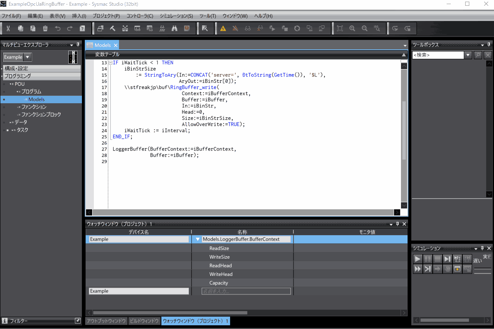
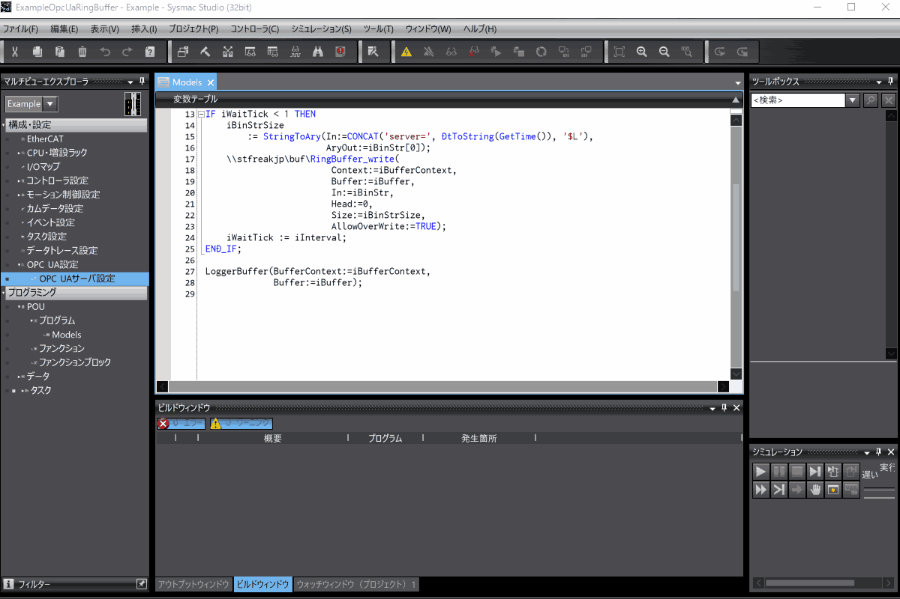
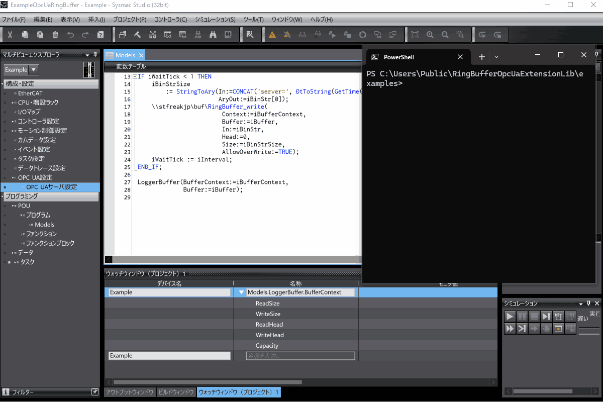

# RingBufferOpcUaExtensionLib
**RingBufferOpcUaExtensionLib** is designed to expose the [RingBuffer](https://github.com/kmu2030/RingBufferLib) on an OPC UA server of a controller or simulator,
allowing it to be manipulated via an OPC UA client.
**RingBufferOpcUaExtensionLib** exposes operations on the **RingBuffer** as pseudo-UA Methods, as demonstrated in [PseudoUAMethodExample](https://github.com/kmu2030/PseudoUAMethodExample).
It also includes a reference client and tests using [PwshOpcUaClient](https://github.com/kmu2030/PwshOpcUaClient).
The tests function both as tests for the reference client and as mocks for server-side information model tests using PwshOpcUaClient.
There's some additional information in the Japanese article, **"OPC UAでRingBufferを公開する"**, available at [https://zenn.dev/kitam/articles/2fc26dfbefc2eb](https://zenn.dev/kitam/articles/2fc26dfbefc2eb).

## Operating Environment
To use the RingBufferOpcUaExtensionLib library, you'll need the following:

| Item | Requirement |
| :--- | :--- |
| Controller | NX1 (Ver. 1.64 or later), NX5 (Ver. 1.64 or later), NX7 (Ver. 1.35 or later), NJ5 (Ver. 1.63 or later) |
| Sysmac Studio | Ver. 1.62 or later |

To use the reference client (`OpcUaRingBuffer.ps1`), you'll need:

| Item | Requirement |
| :--- | :--- |
| PowerShell | 7 or later |

## Development Environment
RingBufferOpcUaExtensionLib is developed in the following environment:

| Item | Version |
| :--- | :--- |
| Controller | NX102-9000 Ver. 1.64 HW Rev. A |
| Sysmac Studio | Ver. 1.63 |
| PowerShell | 7.5.2 |
| Pester     | 5.7.1 |

## Library Structure
RingBufferOpcUaExtensionLib consists of the following:

  * **RingBufferOpcUaExtensionLib.slr**   
    A library for Sysmac projects. Reference it in your project to use.
  * **RingBufferOpcUaExtensionLib.smc2**   
    The Sysmac project for RingBufferOpcUaExtensionLib development.
    It includes test programs for the reference client.
  * **libs/**   
    The dependent libraries for RingBufferOpcUaExtensionLib.

## How to Use the Library
Follow these steps to use the library:

1.  **Reference lib/RingBufferLib.slr in your project.**   
    This step is unnecessary if `RingBufferLib.slr` is already referenced.
2.  **Reference RingBufferOpcUaExtensionLib.slr in your project.**   
3.  **Build the project and confirm there are no errors.**   
    The library uses namespaces.
    Make sure there are no naming conflicts with identifiers in your project.

## Reference Client Structure
The reference client consists of the following:

  * **OpcUaRingBuffer.ps1**   
    The main reference client script.
  * **OpcUaRingBuffer.Tests.ps1**   
    A test script for the reference client that uses `Pester` and `RingBufferOpcUaExtensionLib.smc2`.   
    It also tests the RingBuffer exposed by RingBufferOpcUaExtensionLib, which is part of the information model.
  * **ModelTestController.ps1**   
    Manages the test programs that run in `RingBufferOpcUaExtensionLib.smc2`.
  * **PwshOpcUaClient/**   
    The PwshOpcUaClient. For usage details, refer to [PwshOpcUaClient](https://github.com/kmu2030/PwshOpcUaClient).

## How to Use the Reference Client
The reference client is used for testing and demonstration. The general steps are:

1.  **Set up PwshOpcUaClient.**
2.  **Load PwshOpcUaClient and the reference client into your PowerShell session.**
3.  **Run the code that uses the reference client.**

## Examples
The examples are located in the `examples\` directory.
They include a server project that uses the library and scripts that use the reference client.

The server project (`ExampleOpcUaRingBuffer.smc2`) is common to all examples. The scripts include:

  * **ExampleOpcUaRingBufferRead.ps1**   
    Reads from and writes to the server's RingBuffer.
  * **ExampleOpcUaRingBufferDiff.ps1**   
    Retrieves write differences from the server's RingBuffer using a context maintained by the client.   
    It also writes to the server's RingBuffer.

The script paths are configured to match the repository's directory structure.
If you change the paths, you'll need to modify the locations where `PwshOpcUaClient.ps1` and `OpcUaRingBuffer.ps1` are loaded.

## How to Use the Examples
### Common Information
The examples use an OPC UA server on a controller or simulator and an OPC UA client from PwshOpcUaClient.

When establishing a session or using signing (or signing and encryption) for message exchange,
the server and client may reject each other's certificates.
In both cases, once you **trust the rejected certificate**, it won't be rejected on subsequent connections.

If there are no certificate issues, perform the following steps:

  * **When PwshOpcUaClient rejects the server certificate:**   
    If the server certificate is the one you intended, move it from `PwshOpcUaClient/pki/rejected/certs` to `PwshOpcUaClient/pki/trusted/certs`.
  * **When the server rejects the client certificate:**   
    Trust the rejected certificate on the controller or simulator's OPC UA server.

By default, the example script attempts to connect to the OPC UA server with the following username and password:

| Username | Password |
|-|-|
|taker|chocolatepancakes|

### Using with the Simulator's OPC UA Server
Follow these steps for the Sysmac Studio simulator's OPC UA server:

1.  **Set up PwshOpcUaClient.**   
    Skip this step if it's already set up. Run the following in PowerShell:

    ```powershell
    ../PwshOpcUaClient/setup.ps1
    ```

2.  **Open the Sysmac project (ExampleOpcUaRingBuffer.smc2) in Sysmac Studio and start the simulator.**

3.  **Start and configure the simulator's OPC UA server.**   
    Operate as shown in the GIF to start and configure the OPC UA server.

    

4.  **Run the script.**   
    With the OPC UA server running, execute the following in PowerShell:

    ```powershell
    ./ExampleOpcUaRingBufferRead.ps1 -Interval 0.01
    ```

    Once connected to the OPC UA server, it will manipulate the server's RingBuffer as shown.

    

### Using with a Controller's OPC UA Server
Follow these steps for a controller's OPC UA server:

1.  **Set up PwshOpcUaClient.**   
    Skip this step if it's already set up. Run the following in PowerShell:

    ```powershell
    ../PwshOpcUaClient/setup.ps1
    ```

2.  **Open the Sysmac project (ExampleOpcUaRingBuffer.smc2) in Sysmac Studio and adjust the configuration to match your environment.**

3.  **Transfer the Sysmac project to the controller.**

4.  **Configure the controller's OPC UA server.**   
    Connect to the controller in Sysmac Studio and configure the OPC UA server as shown in the image below.
    After setting the security, you'll need to trust the PwshOpcUaClient's certificate.
    The process shown involves a first access to get the certificate rejected, then moving it to the trusted list.

    

5.  **Run the script.**   
    Replace `YOUR_SERVER_ENDPOINT` with your controller's OPC UA server endpoint and run the following in PowerShell:

    ```powershell
    ./ExampleOpcUaRingBufferRead.ps1 -UseSimulator $false -ServerUrl YOUR_SERVER_ENDPOINT -Interval 0.01
    ```

    Once connected to the OPC UA server, it will manipulate the server's RingBuffer as shown.

    

## License
Code using **PwshOpcUaClient** is licensed under GPLv2. All other code is licensed under the MIT License.
