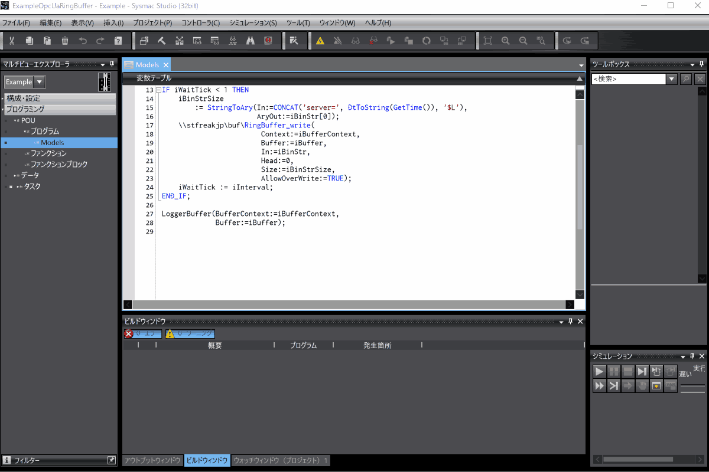
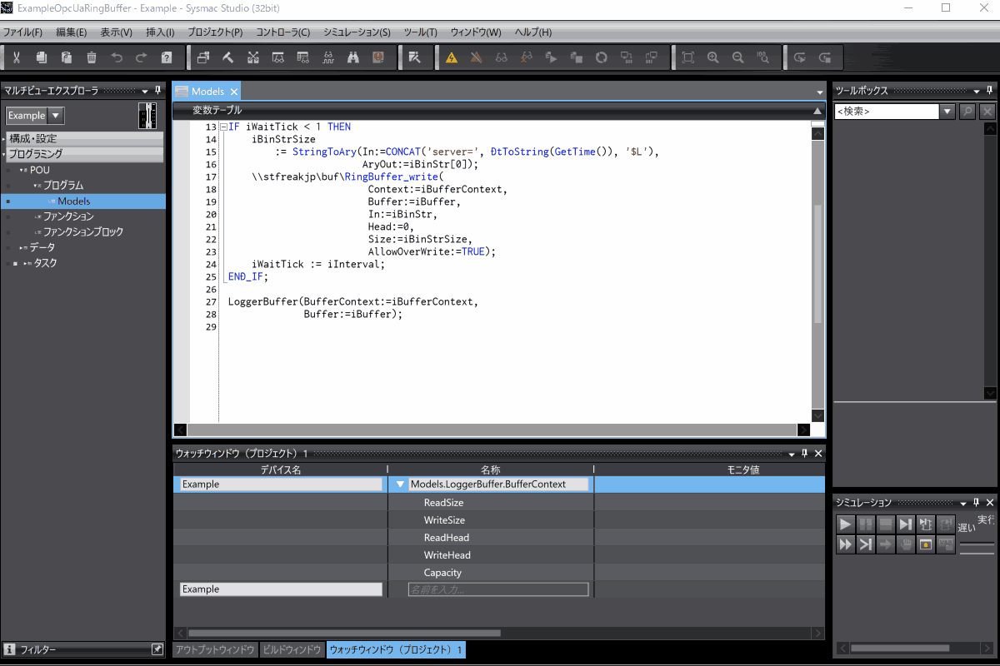

# RingBufferOpcUaExtensionLib
これは、[`RingBuffer`](https://github.com/kmu2030/RingBufferLib)をコントローラまたは、シミュレータのOPC UAサーバで公開し、OPC UAクライアントを介して操作するためのライブラリです。
`RingBufferOpcUaExtensionLib`は、[`PseudoUAMethodExample`](https://github.com/kmu2030/PseudoUAMethodExample)で示す疑似UA Methodとして`RingBuffer`への操作を公開します。
また、[`PwshOpcUaClient`](https://github.com/kmu2030/PwshOpcUaClient)を使用したリファレンスクライアントとテストを含みます。
テストは、リファレンスクライアントのテストであると同時に、`PwshOpcUaClient`を使用したサーバ側情報モデルテストのモックです。

## 使用環境
ライブラリ(`RingBufferOpcUaExtensionLib`)の使用には、以下が必要です。

| Item          | Requirement |
| :------------ | :---------- |
| Controller    | NX1(Ver.1.64以降), NX5(Ver.1.64以降), NX7(Ver.1.35以降), NJ5(Ver.1.63以降) |
| Sysmac Studio | Ver.1.62以降 |

リファレンスクライアント(`OpcUaRingBuffer.ps1`)の使用には、以下が必要です。

| Item          | Requirement |
| :------------ | :---------- |
| PowerShell    | 7以降 |

## 構築環境
`RingBufferOpcUaExtensionLib`は、以下の環境で構築しています。

| Item            | Version              |
| :-------------- | :------------------- |
| Controller      | NX102-9000 Ver.1.64 HW Rev.A |
| Sysmac Studio   | Ver.1.63 |
| PowerShell      | 7.5.2 |
| Pester          | 5.7.1 |

## ライブラリの構成
`RingBufferOpcUaExtensionLib`は、以下で構成します。

* **RingBufferOpcUaExtensionLib.slr**   
   Sysmacプロジェクト用ライブラリです。
   プロジェクトで参照して使用します。

* **RingBufferOpcUaExtensionLib.smc2**   
  `RingBufferOpcUaExtensionLib`開発用のSysmacプロジェクトです。   
  リファレンスクライアントのテストプログラムを含みます。

* **`libs/`**   
  `RingBufferOpcUaExtensionLib`の依存ライブラリです。

## ライブラリの使用手順
ライブラリは、以下の手順で使用します。

1. **`lib/RingBufferLib.slr`をプロジェクトで参照する**   
   既に`RingBufferLib.slr`を参照している場合は不要です。

2. **`RingBufferOpcUaExtensionLib.slr`をプロジェクトで参照する**

3. **プロジェクトをビルドしてエラーが無いことを確認する**   
   ライブラリは名前空間を使用しています。
   プロジェクト内の識別子と名前空間の衝突が生じていないことを確認します。

## リファレンスクライアントの構成
リファレンスクライアントは、以下で構成します。

* **OpcUaRingBuffer.ps1**   
  リファレンスクライアント本体です。

* **OpcUaRingBuffer.Tests.ps1**   
  `Pester`と`RingBufferOpcUaExtensionLib.smc2`を使用するリファレンスクライアンのテストです。   
  `RingBufferOpcUaExtensionLib`で公開する`RingBuffer`は情報モデルでもあり、そのテストも兼ねています。

* **ModelTestController.ps1**   
  `RingBufferOpcUaExtensionLib.smc2`で動作するテストプログラムを操作します。

* **PwshOpcUaClient/**   
   `PwshOpcUaClient`です。
   使用方法は、[`PwshOpcUaClient`](https://github.com/kmu2030/PwshOpcUaClient)を参照します。

## リファレンスクライアントの使用手順
リファレンスクライアントは、テスト及び例示で使用しています。
リファレンスクライアントの使用手順の概略は、以下です。

1. **`PwshOpcUaClient`のセットアップ**

2. **`PwshOpcUaClient`とリファレンスクライアントをPowerShellセッションにロード**

3. **リファレンスクライアントを使用するコードの実行**

## 例示について
例示は、`examples\`にあります。
例示には、ライブラリを使用するサーバプロジェクトとリファレンスクライアントを使用するスクリプトがあります。
サーバプロジェクト(`ExampleOpcUaRingBuffer.smc2`)は共通です。
スクリプトには、以下があります。

* **`ExampleOpcUaRingBufferRead.ps1`**   
  サーバの`RingBuffer`からの読み出しとサーバの`RingBuffer`への書き込みを行います。

* **`ExampleOpcUaRingBufferDiff.ps1`**   
  クライアントが保持するサーバの`RingBuffer`のコンテクストを使用してサーバの`RingBuffer`の書き込み差分を取得します。   
  また、サーバの`RingBuffer`への書き込みを行います。

スクリプトは、リポジトリのディレクトリ構造に合わせてパス構成をしています。
パスを変更する場合、`PwshOpcUaClient.ps1`と`OpcUaRingBuffer.ps1`を読み込んでいる箇所を変更します。

## 例示の使用手順
### 共通事項
例示は、コントローラ、シミュレータのOPC UAサーバと`PwshOpcUaClient`のOPC UAクライアントを使用します。
そのため、サーバとのセッション確立時や、メッセージ交換に署名または、署名と暗号化を使用するとサーバ、クライアントそれぞれが証明書を拒否する可能性があります。
いずれも拒否した証明書を信頼することで、次回の接続から拒否しなくなります。
証明書に問題が無ければ、以下の操作を行います。

* **PwshOpcUaClientがサーバ証明書を拒否したとき**  
   サーバ証明書が意図したものであれば、`PwshOpcUaClient/pki/rejected/certs`に格納されたサーバ証明書を`PwshOpcUaClient/pki/trusted/certs`に移動します。
* **サーバがクライアント証明書を拒否したとき**   
   コントローラ、シミュレータのOPC UAサーバで拒否した証明書を信頼します。

スクリプトは、デフォルトで以下のユーザーとパスワードでOPC UAサーバに接続を試みます。

| ユーザー | パスワード |
|-|-|
|taker|chocolatepancakes|

### シミュレータ用OPC UAサーバでの使用手順
Sysmac Studioのシミュレータ用OPC UAサーバでの手順を示します。
手順は以下です。

1. **`PwshOpcUaClient`のセットアップ**   
   セットアップ済みの場合、不要です。
   以下をPowerShellで実行します。

   ```powershell
   ../PwshOpcUaClient/setup.ps1
   ```

2. **Sysmac StuidoでSysmacプロジェクト(`ExampleOpcUaRingBuffer.smc2`)を開きシミュレータを起動**

3. **シミュレータ用OPC UAサーバの起動と設定**   
   以下のように操作してOPC UAサーバを起動、設定します。
   

4. **スクリプトの実行**   
   OPC UAサーバが起動した状態で以下をPowerShellで実行します。

   ```powershell
   ./ExampleOpcUaRingBufferRead.ps1 -Interval 0.01
   ```

   OPC UAサーバに接続すると以下のようにサーバ側の`RingBuffer`を操作します。
   

### コントローラのOPC UAサーバでの使用手順
コントローラのOPC UAサーバでの手順を示します。
手順は以下です。

1. **`PwshOpcUaClient`のセットアップ**   
   セットアップ済みの場合、不要です。
   以下をPowerShellで実行します。

   ```powershell
   ../PwshOpcUaClient/setup.ps1
   ```

2. **Sysmac StuidoでSysmacプロジェクト(`ExampleOpcUaRingBuffer.smc2`)を開き構成を使用環境に合わせる**

3. **Sysmacプロジェクトをコントローラに転送**

4. **コントローラのOPC UAサーバの設定**   
   Sysmac Studioでコントローラに接続し、以下のように操作してOPC UAサーバを設定します。
   セキュリティ設定を行ったら、`PwshOpcUaClient`のクライアント証明書を信頼するために一度アクセスして拒否させた後、信頼リストに移動しています。
   

5. **スクリプトの実行**   
   以下の`YOUR_SERVER_ENDPOINT`をコントローラのOPC UAサーバエンドポイントに置き換え、PowerShellで実行します。

   ```powershell
   ./ExampleOpcUaRingBufferRead.ps1 -UseSimulator $false -ServerUrl YOUR_SERVER_ENDPOINT -Interval 0.01
   ```

   OPC UAサーバに接続すると以下のようにサーバ側の`RingBuffer`を操作します。
   

## ライセンスについて
`PwshOpcUaClient`を使用するコードは、GPLv2ライセンスです。
その他は、MITライセンスです。
